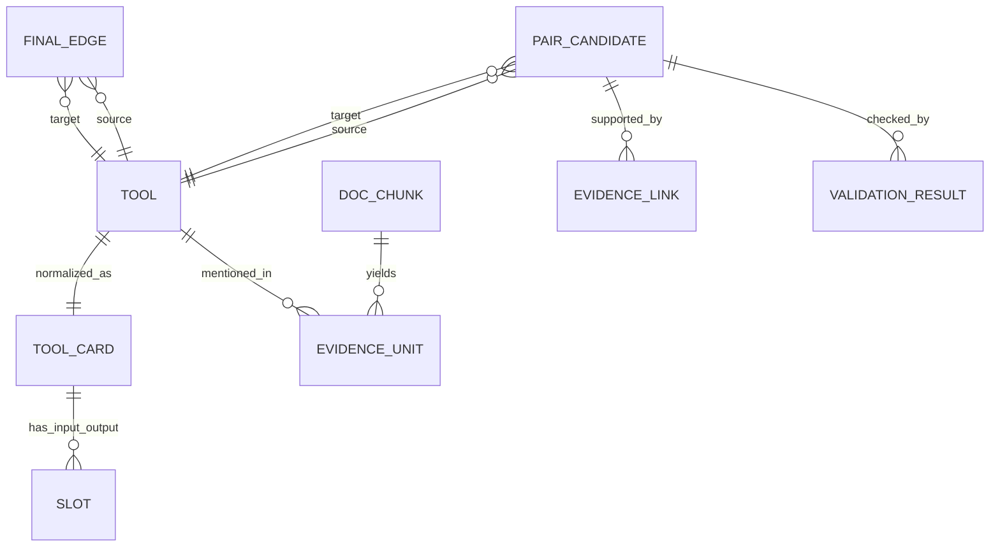
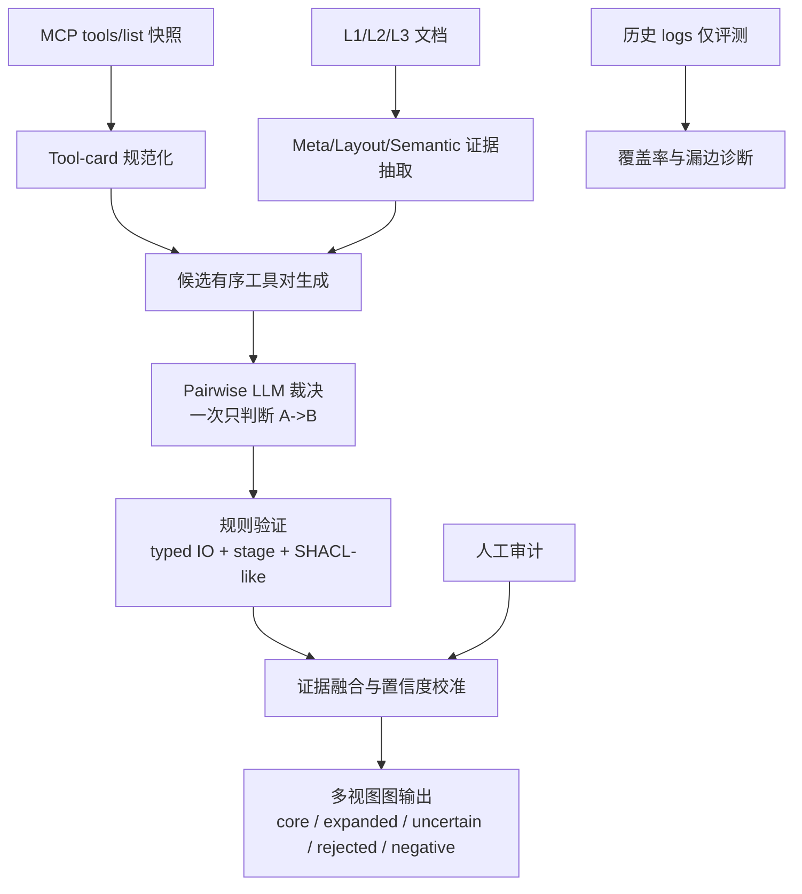

# MolClaw 工具知识图谱研究与工程方案

## 执行摘要

本方案面向 **MolClaw 的 81 个工具**，目标是构建一张**最终只保留工具节点**的 **tool-only directed typed graph**：节点是工具；边是有类型的工具关系；其中绝大多数边的主语义是**直接相邻调用**，即 `A -> B` 表示 **A 的输出可以直接作为 B 的输入或前置条件**。这一表述与 MCP 工具的官方表示方式相容，因为 MCP 将工具定义为带 `name`、`description`、`inputSchema`，并且可选带 `outputSchema` 的可调用单元；工具结果还可含 `structuredContent`，这为 typed IO 抽取与边验证提供了较强的结构基础。citeturn9view0turn11view0turn11view2 结合你们既有交接与约束，本报告以“81 工具、最终图回归 tool-only、边语义偏向直接相邻、历史 logs 仅用于评测”的前提来设计下一代方案。fileciteturn0file0

论文层面，最站得住的 framing 不是“让 LLM 读文档并直接生成全图”，而是：**以 MCP schema + L1/L2/L3 skills 文档为证据源，用 LLM 作为受约束的文档证据抽取器、候选边提出器与局部语义裁决器，再通过 SHACL-like 规则、typed IO 检查、科学工作流阶段约束、人工抽检和置信度校准，输出可审计的多视图 Tool Graph。** 这一路线与 Docs2KG 的文档分层建图思想、KGValidator 的 LLM+规则验证思想、ToolNet/GTool 的工具图规划思想，以及 W3C 的 PROV-O 与 SHACL 标准高度一致。citeturn4view0turn4view1turn0search1turn0search2turn6view1turn4view6turn4view7

本报告的核心建议是：**不要让 LLM 一次性输出全部边**；而是采用 **candidate-first + pairwise adjudication** 的编排方式。先用确定性方法与文档证据高召回生成候选有序工具对 `(A,B)`，再让 LLM **每次只裁决一个 ordered pair**：是否存在正边、负边、`alternative_to` 等非转移边、是否需要中间工具、对应的 edge type、以及具体的 output-to-input/precondition 映射。这样既能把 hallucination 风险局部化，也能把每条边的 provenance、证据 span、验证记录与置信度全部落盘，满足工程可复现与论文可答辩两方面要求。ToolNet 说明 tool graph 对大规模工具导航有明显价值；GTool 明确把依赖边定义为“前一工具功能或输出是后一工具输入或前置条件”；KGValidator 则支持把 LLM 用作图构建结果的自动验证器而非真值源。citeturn0search2turn6view0turn6view1turn0search1

在工程上，建议输出五类图视图：`core`、`expanded`、`uncertain`、`rejected`、`negative`。`core` 服务高精度链路挖掘与高质量 QA；`expanded` 服务高召回候选链；`uncertain` 服务主动审计；`negative` 服务负样本 QA 与错误链解释；`rejected` 则保留被规则或验证器驳回的候选。导出层面，建议以 **JSONL 作为规范主格式**，CSV 作为扁平审阅格式，GraphML 作为图可视化/图算法交换格式，并用 PROV-O 语义做 provenance sidecar。PROV-O 提供了可扩展的 `Entity`、`Activity`、`Agent`、`Plan`、`Role` 等术语，SHACL 则提供了以 shapes graph 校验 data graph 的标准模式。citeturn4view6turn10view4turn10view5turn4view7

从研究借鉴上看，Docs2KG 最适合借来处理 `skills_full` 这类层级文档，因为它把文档知识分为 **MetaKG / LayoutKG / SemanticKG**，并强调 human-LLM collaborative review；MCP-Flow 则表明 MCP 生态下的大规模数据合成、检索库构建与工具评测是切实可行的；AutoSchemaKG 证明了 LLM 驱动 schema induction 的潜力，但其计算代价极高，而且论文自己也承认在高度技术化领域仍存在局限，因此 MolClaw 更适合采用**中粒度固定 edge ontology + 局部自动归纳**，而不应走“完全自治 schema induction”的路线。citeturn4view0turn4view4turn6view3turn1search2turn6view2

## 问题界定与目标产物

### 问题定义

给定工具集合 `T={t1,...,t81}`、MCP 暴露的工具定义、以及 `skills_full` 中的 L1/L2/L3 文档，本项目要构建一个最终只含工具节点的有向多关系图 `G=(V,E)`，其中 `V=T`，边 `e=(A, τ, B)` 表示工具 `A` 与 `B` 之间存在一个类型为 `τ` 的关系。图的主任务不是“工具相似度图”，而是“**科学任务中的直接工具转移图**”。MCP 官方规范已经给出了工具的最低结构基础：`name`、`description`、`inputSchema`，以及可选的 `outputSchema` 与 `structuredContent`；这意味着问题天然适合被形式化为 **schema-guided relation construction**，而不是仅靠自由文本猜边。citeturn11view1turn11view2turn9view1

### 形式化边语义

设工具 `A` 有输出集合 `O_A`、显式产物/前置结果集合 `P_A^+`，工具 `B` 有输入集合 `I_B` 与前置条件集合 `P_B`。对任一**转移类边** `τ ∈ TransitionTypes`，定义：

\[
e=(A,\tau,B)\ \text{成立} \iff \exists o \in O_A \cup P_A^+, \exists i \in I_B \cup P_B,
\]
\[
Compat_\tau(o,i)=1 \land StageOK_\tau(A,B)=1 \land NoRequiredIntermediate_\tau(A,B)=1
\]

其中 `Compat` 同时考虑原始类型、语义类型、格式、单位、基数与约束；`StageOK` 考虑科学工作流阶段相容性；`NoRequiredIntermediate` 表示不存在必需而未满足的中间转换步骤。这个定义与 GTool 对工具依赖的定义基本一致：若 `ti` 的功能或输出是 `tj` 执行所需的输入或前置条件，则存在由 `ti` 指向 `tj` 的依赖边。citeturn6view1

`alternative_to` 需要单独处理。它是**非转移类边**：它不满足“直接邻接调用”的主语义，而表示两个工具在同一阶段或相邻阶段承担**可替代**功能。因此本方案将边分成两大超类：
其一是 **TransitionEdge**，可进入默认 chain mining；其二是 **RelationalEdge**，存储在同一张图里，但默认不参与“下一步工具”链式扩展。这样既能满足你们“最终图保留 typed edge”的要求，又不会污染“直接相邻调用”的正式定义。

### 输入与输出

输入建议冻结为四类：
其一，`tools_snapshot.jsonl`，由 MCP `tools/list` 抓取，保留 `name`、`title`、`description`、`inputSchema`、`outputSchema`、可疑注解等；其二，`skills_full` 解析后的文档块；其三，人工维护的 alias/semantic-type ontology；其四，**仅评测用**的历史 logs。MCP 规范要求 `tools/list` 返回带 `inputSchema` 的工具列表，并允许返回 `outputSchema`；结果侧若存在结构化内容，应置于 `structuredContent`，且客户端应按 schema 校验。citeturn9view0turn11view0turn11view2

输出建议分为两层：
上层是**最终 Tool Graph**，包含 `JSONL/CSV/GraphML` 三种导出；下层是**证据与 provenance 层**，包含 tool cards、document evidence units、candidate pair records、LLM adjudication records、validator records、audit labels、confidence calibration artifacts。论文和工程复现都应将下层工件视为一等公民，而不是只交一张最终图。PROV-O 明确支持把不同系统中的 provenance 信息表示为可交换的 classes、properties 与 restrictions；SHACL 允许将 shape graph 用作 data graph 的校验条件描述。citeturn4view6turn4view7

### 边类型本体

下面这套中粒度 edge ontology 建议直接冻结为 `edge_type_v1`。其中 `ranks_after` 可作为 `ranks_or_scores_for` 的用户别名；工程内部推荐只保留一个规范主名，减少导出歧义。

| edge_type | 定义 | 是否 direct transition | 默认纳入 chain mining | 说明 |
|---|---|---:|---:|---|
| generates_input_for | A 的输出直接成为 B 的输入 | 是 | 是 | 最核心转移边 |
| preprocesses_for | A 对 B 所需对象做净化、修复、标准化、准备 | 是 | 是 | 如结构修复、准备 |
| converts_format_for | A 把对象变成 B 接受的格式/编码 | 是 | 是 | 如文件/结构格式转换 |
| parameterizes_for | A 产生 B 所需参数、阈值、配置或约束 | 是 | 是 | 配置、网格、阈值等 |
| filters_candidates_for | A 从集合中筛出 B 的处理对象 | 是 | 是 | candidate subset |
| ranks_or_scores_for | A 产生分数或排序信号供 B 使用 | 是 | 是 | `ranks_after` 可作别名 |
| validates_output_of | B 是对 A 输出做验证/交叉验证的后继 | 是 | 是 | 方向为 `A -> B` |
| refines_output_of | B 对 A 的结果做后续精化/优化 | 是 | 是 | 方向为 `A -> B` |
| reports_or_summarizes | B 汇总、可视化、报告 A 或前序链结果 | 是 | 是 | 末端汇总 |
| alternative_to | A 与 B 在功能上可替代 | 否 | 否 | 默认不参与 chain |
| requires_intermediate | A 与 B 非直接可连，必须经中间步骤 | 否 | 否 | 作为负边理由，不进正图 |

## 数据模型与本体设计

### Tool-card schema

Tool card 是整个系统的主中间表示。MCP 的 `inputSchema`、可选 `outputSchema` 与 `structuredContent` 为 tool card 提供强结构信号；若 `outputSchema` 缺失，则需要从 `description`、L1 文档与可能的示例结果中补全。MCP 同时提醒：工具元数据和 annotations 不能无条件视为可信，除非来自可信 server，因此 tool card 必须把“字段来源”和“字段置信度”一起落盘。citeturn11view1turn11view2

| 字段 | 类型 | 说明 |
|---|---|---|
| tool_id | string | 规范工具名 |
| title | string | 人类可读标题 |
| description_summary | string | 标准化摘要，不是自由摘要 |
| primary_stage | enum | 主科学阶段 |
| secondary_stages | list[enum] | 次阶段，可空 |
| aliases | list[string] | 工具别名 |
| inputs[] | list[slot] | 规范输入槽 |
| outputs[] | list[slot] | 规范输出槽 |
| preconditions[] | list[slot] | 非显式输入但调用前需满足 |
| side_effects[] | list[slot] | 产生但不作为主输出的副产物 |
| provenance_refs[] | list[string] | 来源证据 ID |
| extraction_confidence | float | tool card 级别置信度 |
| notes | string | 简短说明 |

其中 `slot` 建议固定字段：`name/raw_type/semantic_type/format/unit/cardinality/required/description/source/confidence`。
`semantic_type` 是项目最关键的统一层，建议冻结一套 **MolClaw semantic type ontology**，例如：`protein_sequence`、`protein_structure_pdb`、`repaired_pdb`、`ligand_smiles`、`ligand_3d_conformer`、`docking_pose`、`affinity_score`、`admet_profile`、`candidate_set`、`ranking_table`、`report_markdown`、`image_plot`、`config_param` 等。

### 文档证据 schema

这里直接借鉴 Docs2KG 的三层思想。Docs2KG 明确建议把文档知识分为 **MetaKG、LayoutKG、SemanticKG**，并保留 human-LLM collaborative review 能力与自动构建质量度量。MolClaw 的 `skills_full` 非常适合照此处理，因为 L1/L2/L3 的层级、标题、小节、列表和邻近上下文对边抽取影响极大。citeturn4view0turn4view1

| 层 | 字段 | 作用 |
|---|---|---|
| Meta | `doc_id`, `path`, `skill_level`, `version_hash`, `language`, `modified_time` | 固定文档来源与版本 |
| Layout | `section_id`, `heading_path`, `block_type`, `list_index`, `chunk_id`, `char_span`, `token_span` | 保留层级与局部上下文 |
| Semantic | `mentioned_tools`, `claim_type`, `candidate_edge_type`, `source_output_mention`, `target_input_mention`, `negation`, `modality`, `condition_text` | 承载实际证据 |

`claim_type` 推荐至少包括：`explicit_sequence`、`explicit_io`、`implicit_io`、`conditional_sequence`、`negative_constraint`、`validation_requirement`、`reporting`, `alternative_relation`, `weak_context`。
任何由文档产生的正向边，都必须可回溯到至少一个 `evidence_id + text_span`。

### 科学工作流阶段 taxonomy

这一步不要做得过细，否则 81 个工具很快会陷入边界争议；也不要过粗，否则 stage validator 形同虚设。建议冻结以下十类主阶段：

| stage | 说明 |
|---|---|
| acquisition_lookup | 获取、检索、解析外部生物/化学对象 |
| entity_resolution | ID 解析、名称规范化、对象映射 |
| protein_prep | 蛋白序列/结构准备、修复、标准化 |
| ligand_prep | 配体准备、构象生成、格式整理 |
| generation_editing | 分子生成、编辑、变体构建 |
| simulation_prediction | docking、pose generation、affinity/property 预测 |
| filtering_selection | 候选过滤、约束筛选 |
| ranking_scoring | 打分、排序、重排序 |
| validation_crosscheck | 结果验证、交叉方法确认 |
| reporting_visualization | 报告、汇总、可视化 |

阶段规则应当**同时支持 hard block 与 soft prior**。例如：
`reporting_visualization` 作为源节点时，默认禁止产生新的 transition edge；`alternative_to` 通常要求工具处于同一阶段或近邻阶段；`validates_output_of` 默认要求目标工具位于 `validation_crosscheck`；`reports_or_summarizes` 默认要求目标工具位于 `reporting_visualization`。这些规则是你们领域知识最重要的“科学约束层”，不能只靠 LLM 自己体会。



## 候选对生成与 LLM 编排

### 总体流水线

Docs2KG 证明了“文档分层 + human review”的必要性；ToolNet 与 GTool 则说明工具图在规划时真正有价值的是**局部后继关系**而非全量铺陈。MolClaw 因此应采用“**先生成候选 ordered pair，再对每个 `(A,B)` 单独裁决**”的流程，而不是让模型面对 81 工具全量自由输出。citeturn4view0turn0search2turn6view1



### 候选 pair 生成方法

候选生成建议覆盖五条主路，再叠加一条负边生成路。下面的方法不是“二选一”，而是**并行召回、后续统一 dedupe**。

| 方法 | 输入 | 主要算法 | 优点 | 主要风险 | 在本方案中的定位 |
|---|---|---|---|---|---|
| Schema / typed-IO matching | tool cards | 全 6480 ordered pairs 上做槽位匹配打分 | 高召回、可解释 | 语义假阳性 | 候选主干 |
| L1 提取 | L1 chunks | 规则 + LLM 抽 `explicit_io/implicit_io` | 贴近单工具使用知识 | 文档表达稀疏 | 强证据补充 |
| L2 提取 | L2 chunks | 顺序模式 + LLM 抽 `explicit_sequence` | 高精度 | 覆盖不全 | 高优先强证据 |
| L3 约束推导 | L3 chunks | 抽 stage/validation/reporting 规则 | 提供科学约束 | 不宜直接造普通边 | validator 与模板源 |
| LLM latent proposal | 未被显式覆盖但 schema/stage 有潜力的 pairs | pairwise 低先验提议 | 补 recall | 幻觉风险 | expanded/uncertain 来源 |
| Negative-edge generation | 全体/争议 pairs | 语义不匹配、需中间步骤、显式否定 | 负样本与 QA 高价值 | 容易和 alternative 混淆 | 必需支路 |

#### Schema / typed-IO matching 的建议公式

先对每个 `A -> B` 计算最优槽位匹配：

\[
m_\tau(o,i)=\alpha_\tau S_{sem}+\beta_\tau S_{fmt}+\gamma_\tau S_{name}+\delta_\tau S_{unit}+\epsilon_\tau S_{card}
\]

其中：

- `S_sem`：语义类型得分，`exact=1.0`、`subtype=0.85`、`convertible=0.55`、`incompatible=0`
- `S_fmt`：格式得分，`exact=1.0`、`compatible=0.7`、`lossy_convertible=0.4`
- `S_name`：槽名与描述的 token overlap / embedding 相似度
- `S_unit`：单位相容性
- `S_card`：单值/列表/批次基数相容性

然后对 `B` 的 required slots 做 coverage 罚项：

\[
S^{pair}_{schema}(A,B,\tau) = \frac{1}{|Req_B|}\sum_{i \in Req_B} \max_{o \in O_A \cup P_A^+} m_\tau(o,i) - \lambda_\tau U_{req}
\]

`U_req` 为未覆盖 required 输入的比例。
经验上，若 `S_schema >= 0.45`，可进入候选池；若 `>=0.70` 且 stage 兼容，则应进入高优先裁决队列。MCP 的 `inputSchema`、可选 `outputSchema` 与 `structuredContent` 恰好是此算法的主要原始信号。citeturn11view1turn11view2

#### L1 / L2 文档抽取

文档抽取建议采用**标题保持的 chunking**：按 `heading_path` 切块，每块约 1200–1800 token，块间 10%–15% overlap。L2 中的显式顺序语句（如 then/next/after/→）优先用规则抽，再给 LLM 做补全；L1 中的“工具输出可供谁继续用”则更适合做 `explicit_io/implicit_io` 双标签抽取。任何跨两个以上工具的 workflow，只抽**相邻对**，默认不抽跨边捷径，除非文档有明确“skip-free direct handoff”描述。Docs2KG 强调 Layout 信息与 human review 对提高 KG 质量很重要，这正是保留 `heading_path` 和 `text_span` 的原因。citeturn4view0turn4view1

#### L3 约束推导

L3 的主要职责不是直接产生普通 transition edge，而是产生**约束模板**，例如：
“某类预测结果应该被交叉验证”
“报告阶段只能汇总前序结果”
“某些评分必须基于准备好的结构对象”
这类规则一旦冻结，就进入 stage validator 和 negative-edge generator。这样做能把 L3 从“弱证据边生成器”升级为“科学守门层”。

#### LLM latent proposals

LLM latent proposal 只针对 `schema/stage` 看起来可能成立、但没有显式 L1/L2 证据的 pairs。它只能为 `expanded` 与 `uncertain` 图供给候选，除非后续又获得显式文档证据或人工确认。AutoSchemaKG 表明 LLM 完全自治抽 triple + induce schema 在大规模语料上是可行的，但计算成本极高，而且作者明确承认对高度技术领域仍有限制；因此 MolClaw 更适合“**固定中粒度 schema，本地小规模低先验 latent proposal**”，而非全自动 schema induction。citeturn1search2turn6view2

### Pairwise LLM 编排协议

LLM 的原子工作单元应固定为 **一个 ordered pair `(A,B)`**，而不是一组 pair，更不是整张图。每次调用只接收：

- `source_tool_card`
- `target_tool_card`
- `edge_type candidates`
- `relevant evidence units`
- `stage hints`
- `project ontology excerpt`

并输出**严格 JSON**。不要求模型输出 chain-of-thought；只允许输出简短 `rationale` 和必须引用的 `evidence_ids`。这与 KGValidator 的“结构化验证 + 用户上下文 + 外部证据”取向一致，也符合 MCP 在 trust & safety 上的人在环要求。citeturn0search1turn9view0

推荐的多轮交互如下：

| 轮次 | 对象 | 模型任务 | 是否缓存 |
|---|---|---|---|
| Tool-card round | 单工具 | 补全/规范化 tool card | 是 |
| Evidence round | 单 chunk | 抽 evidence units | 是 |
| Adjudication round | 单 `(A,B)` | 判断正/负/不确定/alternative，并给 edge_types 与 IO mapping | 是 |
| Repair round | 单 `(A,B)` | JSON 修复、字段补齐、冲突修复 | 是 |
| Tie-break round | 高影响或冲突 pair | 更强模型复核 | 是 |

缓存键建议为：

\[
cache\_key = sha256(model\_name || model\_version || template\_version || canonicalized\_payload || decoding\_params)
\]

并持久化 `raw_request`、`raw_response`、`parsed_json`、`latency`、`token_usage`、`retry_count`、`schema_validation_status`。

#### 示例 prompt

```text
[System]
你是 MolClaw Tool Graph 的局部裁决器。你一次只判断一个有序工具对 A->B。
严格输出 JSON，不要输出解释性散文，不要输出思维链。
如果证据不足，不要猜；返回 uncertain。
如果 A 与 B 只是可替代而非直接相邻调用，返回 alternative_to，并将 direct_transition=false。
如果 A->B 不是直接可连，但需要中间工具，返回 negative_transition，并填写 requires_intermediate=true。

[User]
project_rules:
- direct transition 的定义：A 的输出或前置结果可直接作为 B 的输入或前置条件
- edge ontology: [generates_input_for, preprocesses_for, converts_format_for, parameterizes_for,
  filters_candidates_for, ranks_or_scores_for, validates_output_of, refines_output_of,
  reports_or_summarizes, alternative_to]

source_tool_card:
{...}

target_tool_card:
{...}

relevant_evidence_units:
[
  {"evidence_id":"E12","claim_type":"explicit_sequence","text_span":"..."},
  {"evidence_id":"E57","claim_type":"implicit_io","text_span":"..."}
]

required_output_json_schema:
{
  "pair_id": "string",
  "decision": "positive|negative|uncertain|alternative",
  "direct_transition": "boolean",
  "edge_types": [
    {
      "type": "string",
      "source_slot": "string|null",
      "target_slot_or_precondition": "string|null",
      "confidence": "number",
      "evidence_ids": ["string"]
    }
  ],
  "requires_intermediate": "boolean",
  "negative_reason": "string|null",
  "rationale": "string"
}
```

#### 示例 pairwise JSON 输出

```json
{
  "pair_id": "dock_quickvina__to__rank_pose_results",
  "decision": "positive",
  "direct_transition": true,
  "edge_types": [
    {
      "type": "ranks_or_scores_for",
      "source_slot": "docking_scores",
      "target_slot_or_precondition": "score_table",
      "confidence": 0.87,
      "evidence_ids": ["E12", "E57"]
    },
    {
      "type": "reports_or_summarizes",
      "source_slot": "pose_results",
      "target_slot_or_precondition": "input_results",
      "confidence": 0.61,
      "evidence_ids": ["E57"]
    }
  ],
  "requires_intermediate": false,
  "negative_reason": null,
  "rationale": "L2显式顺序支持，且评分表语义类型匹配。"
}
```

### 幻觉抑制与可复现设置

建议将 pairwise adjudication 解码参数固定为 `temperature=0~0.1`、`top_p=1`，若供应商支持则固定 `seed`。每个 prompt 模板都要版本化；每个响应都要经过 JSON Schema 校验；不合格响应走 repair round。更重要的是，**所有正边必须引用 `evidence_ids` 或给出明确的 schema mapping**；否则只能落到 `uncertain` 或 `latent`。这一点应写进系统 prompt，而不是后处理才补救。

## 验证、融合与图导出

### 规则验证器

SHACL 的核心思想是：shape graph 描述 data graph 应满足的条件；验证就是检查 data graph 是否满足这些 shapes。MolClaw 不一定要真的把整套数据先放进 RDF 再跑 SHACL 引擎，但建议采用 **SHACL-like validator 设计**，把每条候选边当成待验证对象，用 shape 的思想定义“硬规则”和“软规则”。citeturn4view7

| 验证器 | 类型 | 主要检查 | 结果 |
|---|---|---|---|
| ShapeEdgeValidator | 硬规则 | `source!=target`、`edge_type` 合法、字段完备 | pass/fail |
| TypedIOValidator | 硬规则 | 语义类型、格式、基数、单位、required 覆盖 | pass/fail |
| DirectnessValidator | 硬规则 | 是否真为直接邻接；是否需要中间工具 | pass/fail |
| StageValidator | 硬/软混合 | 阶段流向、终端阶段约束、替代边同阶段约束 | pass/weak/fail |
| EvidenceSufficiencyValidator | 软规则 | 是否有显式 L1/L2 或强 schema mapping | strong/medium/weak |
| LLMSemanticValidator | 软规则 | 局部语义裁决、自相容性 | score |
| ConflictResolver | 硬规则 | 正边/负边冲突、alternative 与 transition 冲突 | resolve/reject |

特别要强调：`alternative_to` 与 “negative direct transition” 可以对同一 pair 同时成立。也就是说，`A` 和 `B` 可能**互为替代方法**，但 **A 的输出并不能直接喂给 B**。工程上应允许这两个事实共存。

### 证据融合与置信度分解

建议使用**可解释的分解式打分**，然后再经过校准器把 `raw score` 映射为 `P(valid)`。

对 edge type `τ`，定义：

\[
s_{raw}(e,\tau)=b_\tau + w^{\tau}_{schema}s_{schema}+w^{\tau}_{doc}s_{doc}+w^{\tau}_{llm}s_{llm}+w^{\tau}_{stage}s_{stage}+w^{\tau}_{cons}s_{cons}-w^{\tau}_{neg}s_{neg}
\]

其中：

- `s_schema`：typed IO 匹配得分
- `s_doc`：文档证据得分，建议 `L2显式 > L1显式 > L1隐式 > L3模板 > latent`
- `s_llm`：pairwise LLM 的结构化置信度
- `s_stage`：阶段相容得分
- `s_cons`：多证据一致性，例如不同来源是否互相支持
- `s_neg`：显式否定、需中间工具、强冲突的负面得分

若任一硬规则失败，则直接 `rejected`，不参与加权。
然后针对不同 `edge_type` 做**按类型校准**，优先用 `isotonic regression`，次选 `Platt scaling`；训练标签来自人工审计集。

建议的视图阈值：

| 图视图 | 准入条件 |
|---|---|
| core | 硬规则全过，`P(valid) >= 0.80`，且有强证据或双证据支持 |
| expanded | 硬规则全过，`P(valid) >= 0.55` |
| uncertain | 未硬拒绝，但 `0.35 <= P(valid) < 0.55` 或多验证器冲突 |
| negative | 明确“不应直接相邻”，或 `requires_intermediate=true` |
| rejected | 硬规则失败、格式错误、阶段硬冲突、证据自相矛盾 |

### 导出格式

GraphML 适合可视化和图算法，但对多边、多 provenance、长证据列表并不天然友好；因此要把 **JSONL 作为规范主格式**。MCP-Flow 一类工作说明高质量工具数据集的关键在于“结构化、可过滤、可检索”，而不是只给一张图。citeturn4view4turn6view3

| 格式 | 角色 | 建议内容 |
|---|---|---|
| JSONL | 规范主格式 | 一行一条 typed edge；保存全部 metadata |
| CSV | 审阅格式 | 扁平字段，便于人工筛查与表格分析 |
| GraphML | 交换/可视化 | 节点为工具；边带 type/confidence/view |
| PROV sidecar | provenance | 可映射到 PROV-O 的 actor/activity/entity 记录 |

JSONL 的 canonical edge record 建议至少包含：
`edge_id, source_tool, target_tool, edge_type, direct_transition, source_slot, target_slot, stage_src, stage_tgt, confidence_raw, confidence_calibrated, view, evidence_ids, validator_status, negative_reason, provenance_ids, created_at, run_id`

## 评测、审计与可复现性

### 人工审计计划

Docs2KG 已经把 human-LLM collaborative review 视作提高图质量的重要组成部分；KGValidator 也强调自动验证并不意味着可以完全取消人工把关。因此，论文中必须清楚区分 **全自动构建** 与 **人工抽检校准** 两层。citeturn4view0turn0search1

建议第一版审计采用**分层抽样**，总量 250–400 条边。一个稳妥的配额是：

- `core`: 120
- `expanded`: 80
- `uncertain`: 40
- `negative`: 40
- `rejected` 中的边界样本：20

再额外抽 80–120 条长度为 2–5 的工具链做 chain validity 审计。
边审计字段建议固定为：

| 字段 | 标注值 |
|---|---|
| valid_label | valid / invalid / uncertain |
| edge_type_label | ontology 中的规范类型 |
| direct_transition_label | true / false |
| io_mapping_complete | yes / partial / no |
| evidence_sufficiency | explicit / implicit / insufficient |
| stage_ok | pass / weak / fail |
| negative_reason | 枚举 |
| reviewer_id | 标注者 |
| adjudication_note | 简短说明 |

20%–30% 的样本做双人复标，并记录一致性。
高影响边（高中心性、高频 hub、贯穿多链）应提升采样概率，形成**主动审计**队列。

### 评测指标

| 指标 | 定义 | 粒度 | 用途 |
|---|---|---|---|
| Edge Precision | 审计样本中预测正边为真比例 | edge | 主指标 |
| Edge Recall | 在人工构造或审计“应存在边”集合上的召回 | edge | 召回诊断 |
| Type Accuracy | edge_type 命中率 | edge | 本体质量 |
| Directness Accuracy | 是否真为直接邻接的命中率 | edge | 核心语义质量 |
| Negative Precision | 负边判定正确率 | edge | 负样本质量 |
| Chain Validity | 链中所有相邻边均有效且阶段一致的比例 | chain | 下游链挖掘价值 |
| QA Executability | QA 的 expected chain、输入、关键中间产物是否完整可检验 | QA | 数据可用性 |
| Coverage on Logs | 日志中相邻调用 pair 被图覆盖比例 | edge/log | 仅评测 |
| Calibration Error | 置信度与审计真实率偏差 | edge | score 可用性 |

### 历史日志的地位

GTool 明确把历史 tool trajectories 作为图构建来源之一；MCP-Flow 也证明轨迹数据对训练和评测很有价值。**但 MolClaw 当前并不适合把历史 logs 纳入主图构建**，因为你们自己的约束是：logs 来自局限任务，会引入显著 task-distribution bias。最稳妥的做法是把 logs 完全限制在评测侧，计算 `log-edge coverage`, `log-core coverage`, `log-miss diagnosis` 等指标，而不让日志反向决定图是否存在。citeturn6view1turn4view4turn6view3

### Provenance 模型与复现要求

PROV-O 非常适合做 MolClaw 的 provenance 主语义，因为它明确给出了 `prov:Entity`、`prov:Activity`、`prov:Agent` 三个起点类，并支持 `prov:Plan`、`prov:Role` 等限定关系，还支持为领域应用做 specialization。citeturn4view6turn10view0turn10view4turn10view5

推荐映射如下：

| MolClaw 工件 | PROV-O 映射 |
|---|---|
| tools snapshot / tool card / evidence unit / candidate edge / final edge | `prov:Entity` |
| snapshot_tools / parse_cards / extract_evidence / adjudicate_pair / validate / calibrate / export | `prov:Activity` |
| LLM 模型 / 解析器版本 / 人工审计者 | `prov:Agent` |
| prompt template / ontology version / rule set | `prov:Plan` |
| 审计者角色、模型角色 | `prov:Role` |

每次运行必须冻结并记录：
`tool snapshot hash`、`skills docs hash`、`alias map version`、`edge ontology version`、`prompt template version`、`model version`、`decoding params`、`cache manifest`、`artifact checksums`、`run timestamp`。
MCP 本身也强调 tools 的安全与信任要求，并建议始终保留人在环，这与 provenance + audit 的组合完全一致。citeturn9view0turn9view1

## 成本估算、实施路线与风险

### LLM 调用与算力估算

核心规模是固定的：81 个工具对应 **6480 个有序 pair**。但不建议默认全量深裁决；建议采用 candidate-first，再按视图需求决定是否加全量轻扫。下面给出工程上可直接使用的预算表。

| 场景 | 候选 pair 数 | 主裁决 calls | repair calls | tie-break calls | pairwise 总 calls |
|---|---:|---:|---:|---:|---:|
| 保守高精度 | 700 | 700 | 105 | 35 | 840 |
| 平衡方案 | 1200 | 1200 | 180 | 60 | 1440 |
| 高召回 | 1800 | 1800 | 270 | 90 | 2160 |
| 全量轻扫 + 重点深裁决 | 6480 轻扫 + 800 深裁决 | 7280 | 972 | 324 | 8576 |

再加上前置阶段：

- Tool-card round：81–162 calls
- Evidence extraction round：大约 120–250 chunk calls（取决于 `skills_full` 体量）
- Pairwise round：见上表

如果按“平衡方案”估算，单次 pairwise adjudication 平均约 `1.8k input + 0.35k output tokens`，repair 和 tie-break 较短，则 pairwise 总 token 约在 **2.5M input + 0.48M output** 左右；再加上 tool-card 与 evidence extraction，总体可控制在 **3.3M–4.8M input / 0.7M–1.2M output** 的量级。项目预算应使用统一公式：

\[
\text{Cost} = \frac{T_{in}}{10^6}C_{in} + \frac{T_{out}}{10^6}C_{out}
\]

其中 `C_in/C_out` 由实际选用模型定价决定。
重要的是：**可做 transport-level batching，但不做 prompt-level 多 pair 合并**；也就是说，可并发发 8–32 个独立 pair 请求，但每个请求仍只讨论一个 `(A,B)`。

### 实施路线图

| 阶段 | 里程碑 | 交付物 |
|---|---|---|
| 定义冻结 | edge ontology、semantic type ontology、stage taxonomy、JSON schemas 冻结 | `schemas/`, `ontology_v1.yaml` |
| 数据规范化 | MCP snapshot parser、tool-card builder、alias bootstrap | `tool_cards.jsonl` |
| 文档证据层 | chunker、evidence extractor、evidence linker | `evidence_units.jsonl` |
| 候选层 | schema matcher、L1/L2/L3 candidate union、negative generator | `candidate_pairs.jsonl` |
| 裁决层 | pairwise LLM runner、repair、tie-break、cache | `pair_adjudications.jsonl` |
| 验证融合层 | SHACL-like validators、stage rules、confidence calibration | `validated_edges.jsonl`, `calibration.pkl` |
| 图输出层 | core/expanded/uncertain/rejected/negative export | `graph_core.jsonl`, `graph.graphml` |
| 评测层 | audit UI/CSV、manual labels、ablations、QA executability | `audit_labels.csv`, `eval_report.md` |
| 论文层 | methods、appendix、artifact manifest | `paper_methods.md`, `repro_manifest.json` |

若团队配置为 **1 位工程负责人 + 1 位算法工程师 + 1 位领域审核人**，一个实际可执行的周期是 **8–10 周**。其中最容易拖慢的不是编码，而是 ontology 冻结和人工抽样复核。

### 风险与缓解

| 风险 | 表现 | 缓解 |
|---|---|---|
| schema 稀疏、输出不明 | 误把任意文本输出当可用对象 | 优先使用 `outputSchema/structuredContent`，其次才推断 |
| 文档语义模糊 | 共现误判为依赖 | 强制 evidence span + claim_type；弱上下文不造正边 |
| LLM 幻觉 | latent proposal 过多 | 降权；无证据不入 core；强制 JSON+validator |
| pair 数爆炸 | 预算超限 | candidate-first；仅在高召回模式做全量轻扫 |
| stage 规则过硬 | 漏掉跨阶段真边 | 区分 hard block 与 soft prior；保留 uncertain |
| 多边导出困难 | GraphML 丢信息 | JSONL 主格式；GraphML 仅作聚合/可视化 |
| 审计瓶颈 | 标注成本高 | 分层抽样 + 主动审计 + 双标只覆盖关键子集 |
| 工具定义漂移 | 新版 server 与旧图不一致 | 周期性 snapshot + diff + 局部重建 |

## 优先参考文献与实现栈

下面这组文献和规范最值得放进论文的方法部分；其中 MCP、PROV-O、SHACL 是“规范层”；Docs2KG、KGValidator、ToolNet、GTool、MCP-Flow、AutoSchemaKG 是“研究借鉴层”。

| 优先级 | 文献 / 规范 | 建议在论文中承担的角色 |
|---|---|---|
| 最高 | MCP 官方规范 | 说明工具天然具有 `name/description/inputSchema/outputSchema` 等结构，是 typed IO 建图的正式基础。citeturn9view0turn11view1turn11view2 |
| 最高 | PROV-O | 说明 provenance 采用标准化 `Entity/Activity/Agent/Plan/Role` 映射，而不是自创字段集合。citeturn4view6turn10view4turn10view5 |
| 最高 | SHACL | 说明图验证采用 shape-based 思想，存在硬规则与数据图校验层。citeturn4view7 |
| 很高 | Docs2KG | 支撑 `Meta/Layout/Semantic` 文档证据层与 human-LLM collaborative audit。citeturn4view0turn4view1 |
| 很高 | KGValidator | 支撑“LLM 是验证器/裁决器，而不是 KG 真值来源”。citeturn0search1 |
| 很高 | ToolNet | 支撑“最终图是 directed tool graph，边描述工具转移关系”。citeturn0search2turn6view0 |
| 很高 | GTool | 支撑“依赖边可定义为前一工具输出/前置结果服务后一工具输入/前置条件”，并作为为何不直接采纳 trajectory-driven 主图的对照。citeturn6view1 |
| 中高 | MCP-Flow | 支撑 MCP 生态下数据合成、检索库、工具评测与 QA 数据产品化的可行性。citeturn4view4turn6view3 |
| 中高 | AutoSchemaKG | 作为反例与启发：schema induction 有价值，但 MolClaw 不宜走 fully autonomous、算力极重、技术域脆弱的路线。citeturn1search2turn6view2 |

工程实现栈建议则更务实：
解析层使用 `pydantic + jsonschema`；图运算使用 `networkx` 或 `igraph`；如需 RDF/PROV sidecar，可用 `rdflib`；缓存与任务队列用 `SQLite/PostgreSQL + Redis/Celery` 或简化为本地 JSONL manifest；人工审计可先用 CSV + 简单 Web UI 起步，后续再升级到专用标注前端。
论文方法名建议固定为：

> **Evidence-Grounded Pairwise Construction of a Tool-Only Directed Typed Graph for Scientific MCP Tools**

这能准确表达：
不是全自动幻想式 KG 生成，
不是仅靠规则，
也不是日志挖图，
而是**文档证据 + schema + pairwise LLM adjudication + formal validation + provenance + audit** 的完整研究与工程体系。